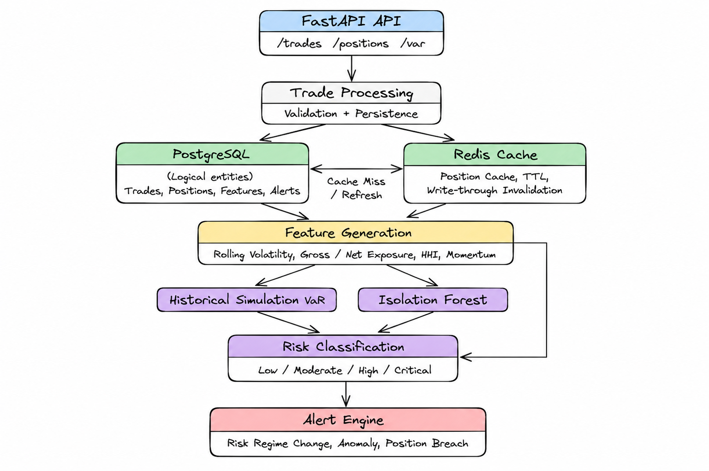

# Portfolio-Risk-Engine

Portfolio-Risk-Engine is a backend service for portfolio risk analytics. It ingests trade data, maintains portfolio positions, computes historical risk metrics, detects anomalous portfolio behavior, and classifies portfolio risk through a REST API.



A trade is sent to the API, validated, and saved to the database. The system then generates updated statistical features, computes historical risk metrics, detects anomalies, classifies the risk regime, and logs alerts if thresholds are breached.

## Why this project?

This project explores how statistical risk analytics, anomaly detection, and backend engineering can be combined into a single portfolio monitoring system. It focuses on system design, feature engineering, caching, and API development rather than predictive trading strategies.

## Core Features

* **Trade Ingestion**: Ingests individual trades, validates parameters, and logs executions in PostgreSQL.
* **Portfolio Position Tracking**: Compounds trade executions to maintain active portfolio holdings.
* **Historical Simulation VaR**: Calculates Value at Risk over rolling windows using historical portfolio price variations.
* **Feature Generation**: Computes rolling volatility, net and gross exposure, HHI concentration, and momentum indicators.
* **Anomaly Detection**: Trains on feature snapshots to detect outlier portfolios and anomalous exposure shocks.
* **Risk Classification**: Classifies the current portfolio risk into Low, Moderate, High, or Critical regimes using trained classifiers.
* **Redis Caching**: Caches active positions to minimize latency on frequent read requests.
* **Alert Generation**: Logs alerts for rule breaches, anomaly detections, and risk regime transitions.

## Technology Stack

| Component | Technology |
| :--- | :--- |
| API | FastAPI |
| Database | PostgreSQL |
| Cache | Redis |
| ML | Scikit-learn |
| ORM | SQLAlchemy |
| Testing | Pytest |

## Project Structure

```
Portfolio-Risk-Engine/
├── app/
│   ├── core/          # Redis and environment configuration
│   ├── models/        # SQLAlchemy database models
│   ├── routers/       # API route handlers
│   ├── schemas/       # Pydantic schema definitions
│   └── services/      # Business logic and risk analytics calculations
├── tests/             # Unit and integration tests
├── benchmark.py       # Pipeline latency benchmarking tool
├── docker-compose.yml # Docker multi-container settings
├── Dockerfile         # Container build instructions
└── requirements.txt   # Application dependencies
```

## API Endpoints

| Method | Route | Purpose |
| :--- | :--- | :--- |
| `POST` | `/portfolios` | Create a new portfolio |
| `GET` | `/portfolios/{id}/positions` | Fetch active holdings |
| `GET` | `/portfolios/{id}/var` | Calculate historical Value at Risk |
| `POST` | `/trades` | Ingest trade and run risk pipeline |
| `GET` | `/portfolios/{id}/trades` | Fetch transaction logs |
| `POST` | `/anomaly/train` | Train Isolation Forest model |
| `GET` | `/portfolios/{id}/anomaly/score` | Get latest anomaly score |
| `POST` | `/risk-classifier/train` | Train risk classifier models |
| `GET` | `/portfolios/{id}/risk-regime` | Get current risk regime classification |
| `POST` | `/portfolios/{id}/simulate` | Run mock trade sequence |
| `GET` | `/health` | Service health check |

## Design Decisions

* **PostgreSQL**: PostgreSQL is used to store trades, positions, features, and alerts. It ensures ACID compliance, transactional safety, and supports relational queries for portfolio auditing.
* **Redis**: Redis acts as an in-memory cache for active portfolio positions. It reduces database load and guarantees sub-millisecond read times for frequent queries.
* **Historical Simulation VaR**: This method computes risk directly from actual historical return distributions. It does not assume normal distributions, making it more accurate for portfolios with non-linear return profiles.
* **Isolation Forest**: This algorithm detects anomalies in portfolio features without requiring pre-labeled training data. It is well-suited for identifying multi-dimensional exposure outliers and sudden shocks.
* **Chained Classification**: The risk classifier combines statistical risk metrics, anomaly signals, and engineered portfolio features to make risk regime predictions.
* **Cache Invalidation**: The system deletes the cache key when a new trade is committed to the database. This write-through invalidation avoids serving stale holdings while maintaining low-latency reads.

## Running Locally

1. Clone the repository:
```bash
git clone https://github.com/anushaanand60/Portfolio-Risk-Engine.git
cd Portfolio-Risk-Engine
```

2. Install dependencies:
```bash
pip install -r requirements.txt
```

3. Run services using docker compose:
```bash
docker-compose up --build -d
```

4. Start the API locally:
```bash
uvicorn app.main:app --port 8000
```

## Running Tests

Run the test suite using pytest. Ensure your PYTHONPATH is set:
```bash
$env:PYTHONPATH="."
pytest
```

## Benchmark

The `benchmark.py` script generates mock trades, trains the anomaly detector and risk classifier, and measures step latencies for trade ingestion, feature generation, anomaly scoring, and risk classification.

To run the benchmark:
```bash
python benchmark.py --trades 350 --latency-runs 100
```